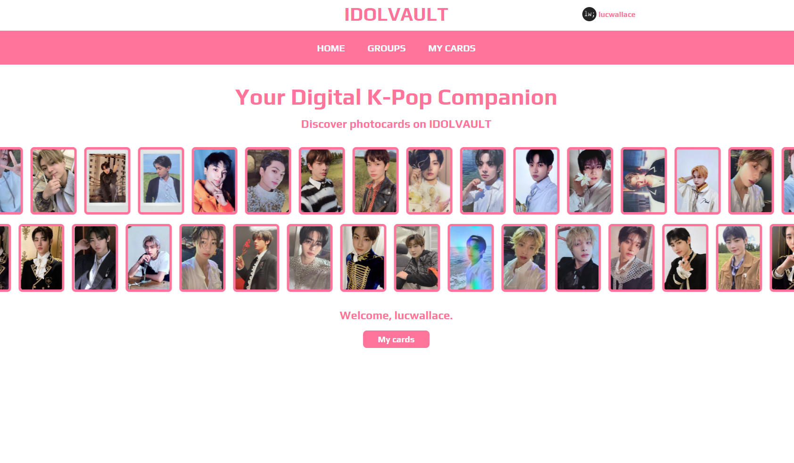

# idolvault

### Your digital K-Pop Companion



# Features

### Photocards

Photocards from different groups are organised in album collections which can be sorted via search filters.

### User accounts

Users can sign up using OAuth with Google, Discord or Spotify.

Users are able to save their own photocards and choose their own idol biases.

Users can follow each other.

### Spotify stats

Every group's Spotify stats can be viewed on their info page.

# Backend hosting instructions

Install Go 1.22.5 or higher.

Create a PostgreSQL database with the structure found in `db_structure.sql`.

Create a .env file in the project folder with the following structure (replace with own values):

```
POSTGRES_URI=...
SPOTIFY_CLIENT_ID=...
SPOTIFY_CLIENT_SECRET=...
GOOGLE_CLIENT_ID=...
GOOGLE_CLIENT_SECRET=...
SESSION_SECRET=...
DISCORD_CLIENT_ID=...
DISCORD_CLIENT_SECRET=...
PORT=8080
DOMAIN=example.com
```

Compile the code:

```
go build ./cmd/server
```

Run the server (runs on port 8080):

```
./server.exe
```

# Backend development

Use [air](https://github.com/air-verse/air) for fast reload:

```
go install github.com/air-verse/air@latest
```

```
air
```

Install [https://www.npmjs.com/package/prettier-plugin-go-template](prettier-plugin-go-template) for easy
template formatting.
